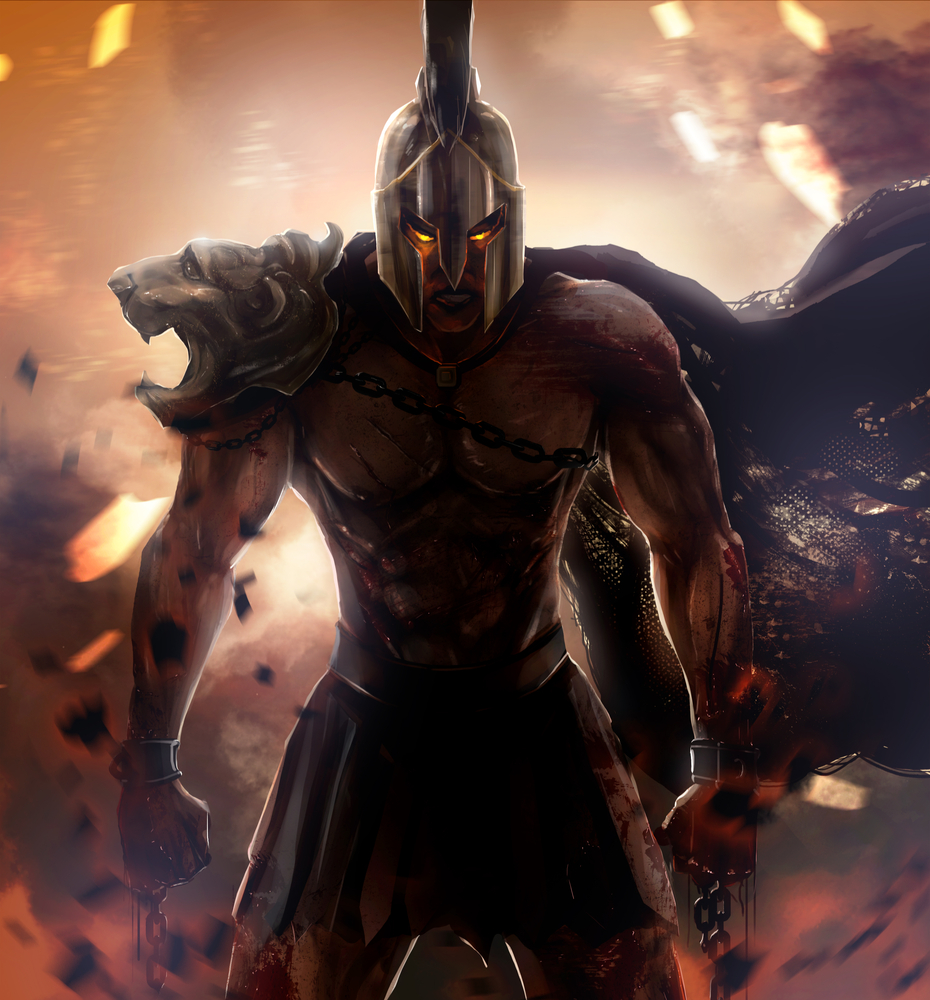
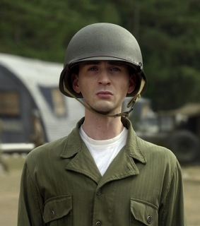

#Keyboard Warrior

##Synopsis

###The project is the development of a game.  

###The modality of the game is a text based typing game where the user is racing against a timer to see how many words they can type.
### I have adjusted the timer so that it increases in size for every second. This is so the user feels more pressurised. 

###An additional feature i have included was the 'Matrix' theme background to increase the distraction. 

##Motivation
>###This project is to show that I am capable of effectively using the techologies taught too us within the first two weeks of the course to create a product.
>###We were given a week to come up with a game idea and present it before our instructors and other consultants for approval. 
>###We had covered the HTML, CSS, JavaScript and the JQuery framework. These were the expected technologies that we had to use and all that was necessary for the creation of the game. 
>###For managing our programme, we used git to divied up our progress in stages and G ithub to be able to make pull request to the website platform for the evealuation of the first and final sprints by our instructors.

##Functionality
>####I came up with around the lines of 10fastfingers.com
>####Used the principal logic behind the program is
* The core functionality comes from two Math.random functions
    * first selects a random word from the array
    * second matches the input from the user to the random word appeared
* There are two identical functions for each of the characters 
    * the user is pressured with time which increaes in size
    * They make use of the random word in yellow which stands out from the gif background
* if the user gets more than or equal to 12 inputs; they are considered a 'Spartan'. Otherwise, they are considered a new recruit

It was created within a single HTML page that uses javascript functions to switch between the content to be displayed.

The first display contains the main page; with buttons asking if the user wishes to start the game or read the instructions. The main display also includes audio in the background for when the page is loaded. 

##Running

The game is running from the browser

Initial page allows you to start the game and try to become a 'Spartan'.
Once the 'Begin' button is clicked; the user has to click on the input box for them to insert the word. 

##Code Example

function typeofwinner(event) {
if (countword >= 12) {
	
		$('.h3container').append("<h3> YOU ARE A SPARTAN </h3>");// if they meet the reuiqrement, thye are considered a spartan
	
		$('.h3container').append("");	// get the image of the spartan to appear from the images folder
	}
	else {
		
		$('.h3container').append("<h3> You are a new recruit. Keep trying. </h3>");// if the user does not meet the if statement; they are considered a new recruit
		
		$('.h3container').append("");
		}// get the image of the new recruit in the images folder
	}

##Built With

* HTML5 
* CSS3 
* JavaScript